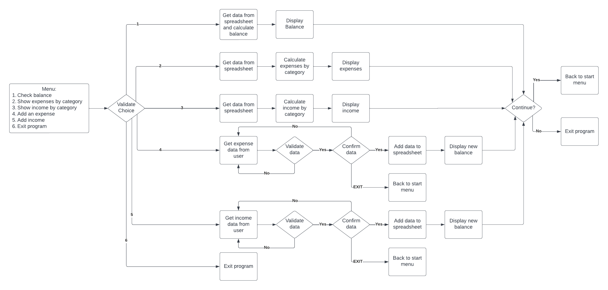

# Personal Finance

[Visit the live application](https://personal-finance-pp3.herokuapp.com/)

Developed by: [Carlos Felipe Capobianco Sandoli](https://github.com/felipesandoli)

## Table of Content:

- [Project Overview](#project-overview)
    - [Project Goals](#project-goals)
    - [User Stories](#user-stories)
- [Design](#design)
    - [Project Flowchart](#project-flowchart)
    - [Features](#features)
- [Technologies Used](#technologies-used)
- [Future Improvements](#future-improvements)
- [Testing](#testing)
    - [Validation](#validation)
    - [Manual Testing](#manual-testing)
- [Deployment](#deployment)
- [Credits](#credits)

## Project Overview

### Project Goals

The objective of this project is to provide an application for managing personal finance. The user can check their balance, add new expenses and incomes and check the total amount spent or earned for each of a set of categories.

### User Stories

- As a user I would like to check my balance
- As a user I would like to check how much I have spent in different types of expenses.
- As a user I would like to check how much I have earned from different sources.
- As a user I would like to log in new expenses.
- As a user I would like to log in new earnings.

## Design

### Project Flowchart

This flowchart demonstrates the logic behind the application:

### Features

## Technologies Used

- Python 3.8.10 for developing the application.
- Git for version control.
- GitHub for hosting the repository.
- Heroku for deploying the application.
- Google Sheets for storing the data.
- Google Sheets and Google Drive API for retrieving data and adding new data to the spreadsheet.
- Colorama for adding better visual feedback to the user.

## Future Improvements

## Testing

### Validation

### Manual Testing

## Deployment

## Credits

- [Stack Overflow](https://stackoverflow.com/questions/2084508/clear-terminal-in-python): Clearing the terminal.
- Love Sandwiches project: Code for validating input and connecting to the API.
- [Colorama](https://pypi.org/project/colorama/): Adding more visual feedback to the user with colored text.