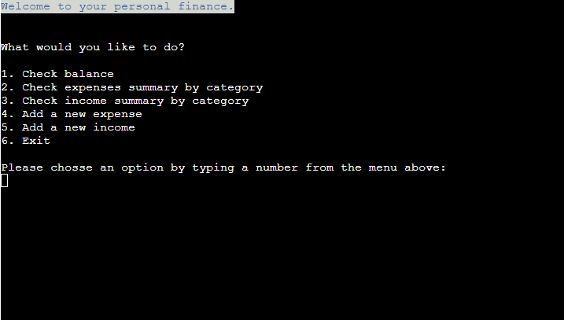
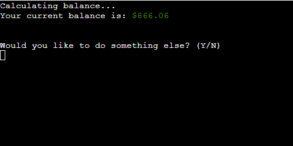
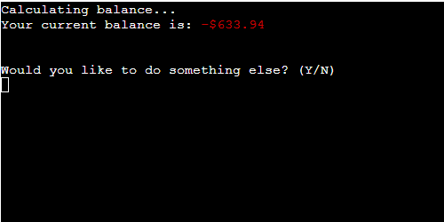
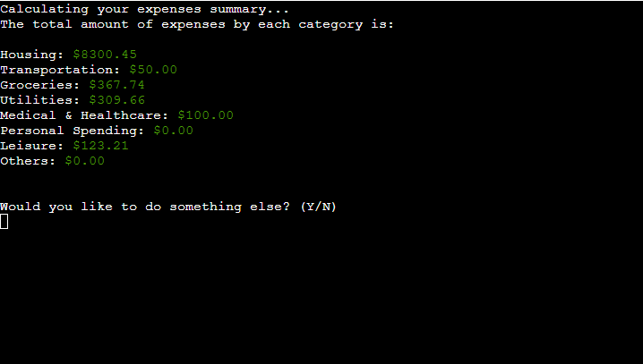
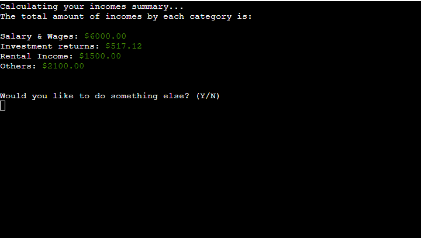
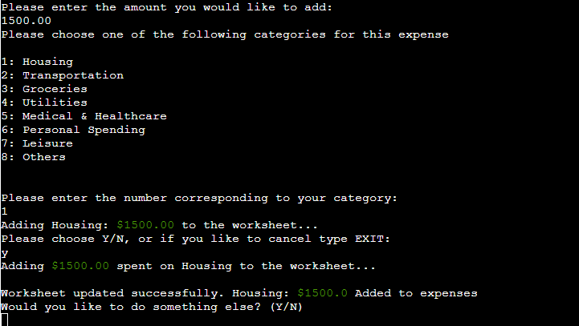
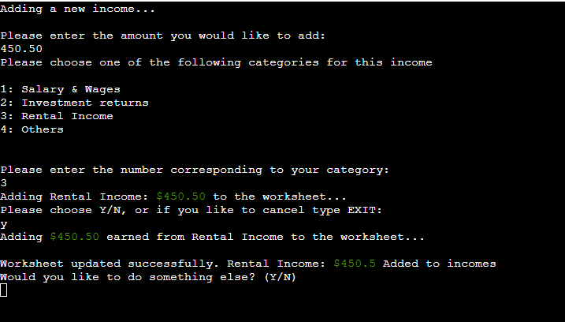
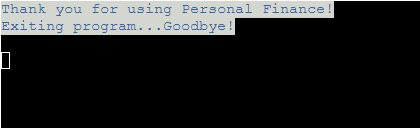
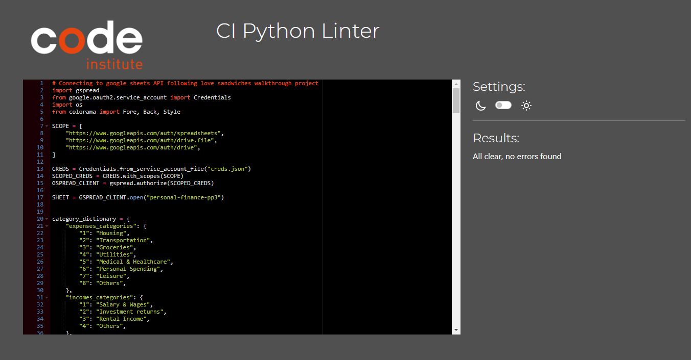

# Personal Finance

[Visit the live application](https://personal-finance-pp3.herokuapp.com/)

Developed by: [Carlos Felipe Capobianco Sandoli](https://github.com/felipesandoli)

## Table of Content:

- [Project Overview](#project-overview)
    - [Project Goals](#project-goals)
    - [User Stories](#user-stories)
- [Design](#design)
    - [Project Flowchart](#project-flowchart)
    - [Features](#features)
- [Technologies Used](#technologies-used)
- [Future Improvements](#future-improvements)
- [Testing](#testing)
    - [Validation](#validation)
    - [Manual Testing](#manual-testing)
- [Deployment](#deployment)
- [Credits](#credits)

## Project Overview

### Project Goals

The objective of this project is to provide an application for managing personal finance. The user can check their balance, add new expenses and incomes and check the total amount spent or earned for each of a set of categories.

### User Stories

- As a user I would like to check my balance
- As a user I would like to check how much I have spent in different types of expenses.
- As a user I would like to check how much I have earned from different sources.
- As a user I would like to log in new expenses.
- As a user I would like to log in new earnings.

## Design

### Project Flowchart

This flowchart demonstrates the logic behind the application:

### Features

The following are a description of the program features when the correct inputs are entered. The input validation errors will be shown in the [manual testing](#manual-testing) section.

- Main menu

The main menu contains 6 options for the user to chose.

- Displaying the balance

This option deducts the total amount of expenses from the total amount of earnings and displays it to the user. A negative amount is shown in red, a positive amount in green.

- Displaying expenses summary

Adds all the expenses of each category and displays a summary to the user.

- Display incomes summary

Adds all the earnings of each category and displays a summary to the user.

- Add new expense

Requests the amount and category to the user. Displays the amount and category and asks if the user would like to confirm. Confirming will add the amount and category entered to the spreadsheet in the expenses worksheet. If the user choses not to confirm by entering N, deletes the previous amount and category entered and asks for it again. Chosing the EXIT option will return to the main menu.

- Add new income

Requests the amount and category to the user. Displays the amount and category and asks if the user would like to confirm. Confirming will add the amount and category entered to the spreadsheet in the incomes worksheet. If the user choses not to confirm by entering N, deletes the previous amount and category entered and asks for it again. Chosing the EXIT option will return to the main menu.

- Exit program

This can be done by chosing option 6 in the main menu or by typing N when prompted if the user would like to do anything else. Displays a goodbye message and closes the program.

## Technologies Used

- Python 3.8.10 for developing the application.
- Git for version control.
- GitHub for hosting the repository.
- Heroku for deploying the application.
- Google Sheets for storing the data.
- Google Sheets and Google Drive API for retrieving data and adding new data to the spreadsheet.
- Colorama for adding better visual feedback to the user.

## Future Improvements

- Using the datetime python module to add the date an expense or income is being added to the spreadsheet. This would take the current date when the users enter new data.
- Displaying the amount that has been spent or earned for each month/year.
- Add the option for the user to add a description for new data being entered.
- Add the option for the user to chose a category to display all the expenses or incomes for that category with its respective descriptions, dates and times.

## Testing

### Validation

The code was validated using the [PEP8 CI Python Linter](https://pep8ci.herokuapp.com/). Initially a few errors regarding line lengths, error handling and comparisson code were found. These were fixed and the code passed with no errors.

### Manual Testing

## Deployment

This application was deployed through Heroku. The following are the steps followed for deployment:

1. In the terminal type `pip3 freeze > requirements.txt`. This is to make sure all dependencies used in the project are listed in the requirements.txt file. Heroku will search for this file to install the necessary dependencies when building the application so it can work correctly when running it in the mock terminal.
2. On Heroku dashboard after login in, click on New and Create new app.
3. Add your application name, choose the correct reagion and click on create app.
4. Go to the settings tab.
5. If your application contains credentials that are not commited to the GitHub repository, these need to be added in the Config Vars. In the Config Vars sectins click on Reveal Config Vars to add a new config var. In the field for KEY type CREDS and in the field for VALUE add the content from your credentials json file. Then click add.
6. Still in the Config Vars section add another config var with PORT in the KEY field and 8000 in the Value field.
7. In the Buildpacks section click in Add Build Pack. Select Python and click Save Changes. Repeat this process for nodejs. It is important that python sits on top of nodejs.
8. Head to the deploy tab to chose your deployment method.
9. Select GitHub and click on Connect to GitHub.
10. Search for your GitHub Repository and click on Connect.
11. If you would like to enable automatic deployment, so Heroku automatically updates the application when changes are pushed into the repository, click on this option and then click on Deploy Branch, making sure the correct branch is selected. If you dont want automatic deployment, leave it unselected and only click on Deploy Branch.
12. Heroku will display a message stating that the app was successfully deployed and a button to open the deployed application.

## Credits

- [Stack Overflow](https://stackoverflow.com/questions/2084508/clear-terminal-in-python): Clearing the terminal.
- Love Sandwiches project: Code for validating input and connecting to the API.
- [Colorama](https://pypi.org/project/colorama/): Adding more visual feedback to the user with colored text.